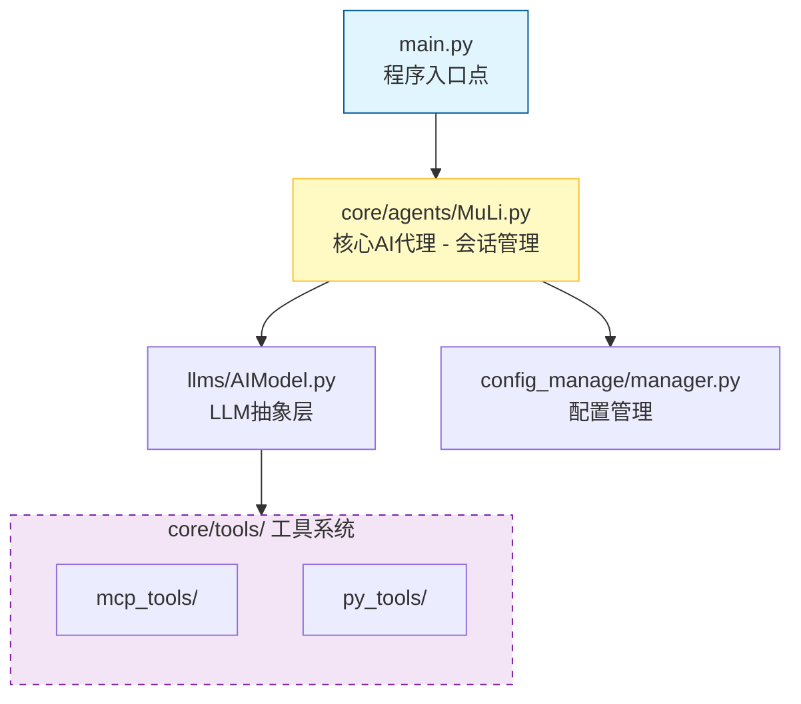

# MuLi (沐璃) - 一个强大的拟人AI助手

<div align="center">

[](https://www.python.org/)
[](LICENSE)

**🤖 一个集成了MCP工具、Docker容器交互和持久化会话的智能AI助手**

</div>

---

## 📖 项目简介

MuLi (沐璃) 是一个功能强大的拟人化AI助手，专为需要复杂工具调用和会话管理的场景设计。它采用异步架构，支持持久化会话历史、自动上下文压缩，并集成了多种实用工具。

### ✨ 核心功能

- **🧠 智能对话系统**: 支持工具调用、会话历史持久化
- **🔄 自动上下文管理**: Token超限自动摘要，保持对话连贯性
- **🛠️ 多工具集成**:
  - **MCP工具**: context7、filesystem、playwright
  - **Python工具**: 天气查询、Docker容器shell交互
- **🐳 Docker容器交互**: 在安全的容器环境中执行命令
- **💾 会话持久化**: 支持历史对话恢复和日志回放
- **🎯 多LLM支持**: 支持DeepSeek、OpenAI等多种提供商
- **⚡ 异步架构**: 非阻塞的工具调用和I/O操作

---

## 🚀 部署教程

本教程适合零基础用户，请按照步骤逐步操作。

### 📋 前置条件

在开始之前，请确保你的系统已安装以下软件：

1. **Python 3.13+**: [下载地址](https://www.python.org/downloads/)
2. **Node.js 18+**: [下载地址](https://nodejs.org/)
3. **Docker**: [下载地址](https://www.docker.com/products/docker-desktop/)
4. **Git**: [下载地址](https://git-scm.com/downloads)

### 🛠️ 环境准备

#### 1. 安装 uv (Python包管理器)

`uv` 是一个快速的Python包管理器，比传统的pip更快。

**Windows (PowerShell):**
```powershell
powershell -ExecutionPolicy ByPass -c "irm https://astral.sh/uv/install.ps1 | iex"
```

**macOS/Linux:**
```bash
curl -LsSf https://astral.sh/uv/install.sh | sh
source ~/.bashrc  # 或 ~/.zshrc
```

验证安装：
```bash
uv --version
```

#### 2. 安装 npm (Node.js包管理器)

npm通常会随Node.js一起安装，验证安装：
```bash
npm --version
```

#### 3. 安装 Docker

按照官方文档安装Docker Desktop，安装完成后启动Docker服务。

验证安装：
```bash
docker --version
docker ps  # 应该能看到运行的容器列表（可能为空）
```

### 📦 项目部署

#### 步骤 1: 克隆项目

```bash
git clone https://github.com/69gg/MuLi/
cd MuLi
```

#### 步骤 2: 创建虚拟环境并安装依赖

使用 `uv` 安装项目依赖：

```bash
uv sync
```

#### 步骤 3: 配置 API 密钥

项目配置文件为 `config.json`，需要填写以下API密钥（更多提示详见`config.json.example`注释）：

```json
{
  "model_config": {
    "max_context_tokens": 65536, 
    "main_model": {                       // 主模型配置
      "model_name": "deepseek-reasoner",
      "provider_type": "deepseek",       // deepseek 或 openai
      "api_key": "sk-your-api-key-here", // 你的API密钥
      "api_base_url": "https://api.deepseek.com"
    },
    "json_model": {                       // JSON输出模型配置
      "model_name": "deepseek-reasoner",
      "provider_type": "deepseek",
      "api_key": "sk-your-api-key-here",
      "api_base_url": "https://api.deepseek.com"
    }
  },
  "tools_api_config": {
    "get_weather": {
      "api_key": "your-weather-api-key"   // 天气API密钥，前往xxapi.cn获取
    },
    "shell_for_ai": {
      "enable": true,
      "container_name": "ai_shell_container", //容器名称
      "mount_mapping": ""
    }
  },
  "mcp_tools": {
    "mcpServers": {
      "context7": { ... },
      "filesystem": { ... },
      "playwright": { ... }
    }
  }
}
```

**获取API密钥的详细说明：**

##### 🔑 DeepSeek API 密钥

1. 访问 [DeepSeek开放平台](https://platform.deepseek.com/)
2. 注册/登录账号
3. 进入"API Keys"页面
4. 点击"创建API密钥"
5. 复制生成的密钥，填写到 `config.json` 的 `api_key` 字段

> `deepseek-reasoner`模型效果最佳。

> 你也可以使用其他兼容OpenAI的厂商的服务。

##### 🌤️ 天气API密钥

项目使用 [小小API](https://xxapi.cn/) 的天气服务：

1. 访问 [小小API文档](https://xxapi.cn/)
2. 天气接口是免费的，密钥仅供认证
5. 将密钥填入 `config.json` 的 `tools_api_config.get_weather.api_key` 字段

#### 步骤 4: 启动 Docker 容器（用于shell工具）

项目集成了一个强大的Docker容器shell交互工具，需要先启动一个Docker容器。

创建并启动容器：
```bash
docker run -d --name ai_shell_container \
  ubuntu tail -f /dev/null
# 或者其他你需要的任何目录映射，记得填入config.json
```

**参数说明：**
- `-d`: 后台运行
- `--name ai_shell_container`: 容器名称（必须与 `config.json` 中的一致）
- `ubuntu`: 使用的镜像
- `tail -f /dev/null`: 保持容器持续运行

验证容器运行状态：
```bash
docker ps
# 应该能看到名为 ai_shell_container 的容器在运行
```

#### 步骤 5: 启动项目

运行主程序：
```bash
python main.py
```

如果一切正常，你会看到：
```
正在加载工具，请稍候...
加载完成！
>
```

现在你可以开始与MuLi对话了！

### 🔧 MCP工具说明

项目预配置了几个MCP工具，具体配置详见`config.json(.example)`。

---

## 🔧 高级调优

### 🛠️ 如何添加自定义 MCP 工具

MCP (Model Context Protocol) 工具通过标准化接口为AI提供扩展功能。添加新的MCP工具非常简单：

#### 步骤 1: 找到MCP工具包

在 [npm官网](https://www.npmjs.com/) 搜索 "mcp" 或 "modelcontextprotocol"，例如：
- `@modelcontextprotocol/server- Brave`
- `@modelcontextprotocol/server-postgres`

#### 步骤 2: 安装并配置

以添加 Brave 搜索工具为例：

**方式一: 使用 npx 直接运行（推荐）**

修改 `config.json`，在 `mcp_tools.mcpServers` 中添加：

```json
{
  "mcp_tools": {
    "mcpServers": {
      "brave-search": {
        "command": "npx",
        "args": [
          "-y",
          "@modelcontextprotocol/server-brave"
        ],
        "env": {
          "BRAVE_API_KEY": "your-brave-api-key"
        }
      }
    }
  }
}
```

**方式二: 全局安装后使用**

```bash
npm install -g @modelcontextprotocol/server-brave
```

然后在 `config.json` 中配置：
```json
{
  "brave-search": {
    "command": "mcp-server-brave",
    "env": {
      "BRAVE_API_KEY": "your-brave-api-key"
    }
  }
}
```

#### 步骤 3: 重启项目

```bash
python main.py
```

新的工具会自动加载，你可以在对话中直接使用。

### 🐍 如何添加自定义 Python 工具

项目支持添加自定义Python工具，工具会自动注册和加载。

#### 示例: 添加一个计算器工具

**步骤 1: 创建工具文件**

在 `/data0/MuLi/core/tools/py_tools/` 目录下创建新文件 `calculator.py`：

```python
## -!- START REGISTER TOOL -!- ##
## -!- START TOOL DEFINITION -!- ##
TOOL_NAME = "calculator"
TOOL_DESCRIPTION = "A simple calculator tool that can perform basic arithmetic operations."
TOOL_FUNCTIONS = ["add", "subtract", "multiply", "divide"]
TOOL_PARAMETERS = [
    [{"a": "First number", "b": "Second number"}],
    [{"a": "First number", "b": "Second number"}],
    [{"a": "First number", "b": "Second number"}],
    [{"a": "First number", "b": "Second number"}]
]
## -!- END TOOL DEFINITION -!- ##

def add(a: float, b: float) -> float:
    """Add two numbers."""
    return a + b

def subtract(a: float, b: float) -> float:
    """Subtract b from a."""
    return a - b

def multiply(a: float, b: float) -> float:
    """Multiply two numbers."""
    return a * b

def divide(a: float, b: float) -> float:
    """Divide a by b."""
    if b == 0:
        return "Error: Division by zero"
    return a / b

## -!- END REGISTER TOOL -!- ##
```

**关键说明**：
- 工具必须在 `## -!- START REGISTER TOOL -!- ##` 和 `## -!- END REGISTER TOOL -!- ##` 之间
- `TOOL_NAME`: 工具的唯一名称
- `TOOL_DESCRIPTION`: 工具的描述，帮助AI理解工具用途
- `TOOL_FUNCTIONS`: 工具提供的函数列表
- `TOOL_PARAMETERS`: 每个函数的参数列表（列表的列表）

**步骤 2: 无需额外配置**

Python工具会自动扫描并加载，无需修改配置文件。

**步骤 3: 测试工具**

启动项目后，尝试输入：
```
> 使用计算器工具计算 123 乘以 456 的结果
```


### ⚙️ 配置文件参数调优

#### 调整上下文限制

在 `config.json` 中：

```json
{
  "model_config": {
    "max_context_tokens": 65536  // 默认值为65536
  }
}
```

这个值控制对话历史的长度，超过后会触发自动摘要。

---

## 📚 项目详解

### 🏗️ 架构设计



支持的LLM提供商: DeepSeek、OpenAI（以及任何兼容厂商）

工具类型:
1. MCP工具 - 通过FastMCP集成
如：
   - context7、filesystem、playwright

2. Python工具 - 自定义开发
如：
   - get_weather (天气查询)
   - shell_for_ai (Docker容器交互)
```

### 🗂️ 核心模块说明

#### 1. main.py - 程序入口

```python
from rich.console import Console
console = Console()

async def main():
    ml = MuLi(console=console)

    async with mcp_client:  # 使用持久的MCP客户端
        while True:
            user_input = await asyncio.to_thread(input, "> ")
            response = await ml.chat(user_input)
            console.print(Markdown(response))
```

**关键特性**:
- 异步主循环，支持后台任务（MCP心跳）
- Rich终端美化输出
- Markdown渲染支持

#### 2. core/agents/MuLi.py - 核心AI代理

**主要功能**:
- 会话历史管理（保存到 `history/dialog.json`）
- Token计数和上下文压缩
- 历史记录恢复和回放
- 工具调用协调

**关键代码**:
```python
class MuLi:
    def __init__(self, console):
        self.config = ConfigManager("config.json")
        self.max_context_tokens = self.config.get("model_config.max_context_tokens", 8000)
        self.ai = AIModel(...)  # 初始化LLM
        self._restore_session()  # 恢复历史会话

    def _restore_session(self):
        """从dialog.json恢复会话历史"""
        session_file = "history/dialog.json"
        if os.path.exists(session_file):
            with open(session_file, "r") as f:
                messages = json.load(f)
            self.ai.messages = messages
```

#### 3. core/tools/py_tools/ - Python工具系统

工具自动注册机制：
```python
## -!- START REGISTER TOOL -!- ##
## -!- START TOOL DEFINITION -!- ##
TOOL_NAME = "tool_name"
TOOL_DESCRIPTION = "工具描述"
TOOL_FUNCTIONS = ["func1", "func2"]
TOOL_PARAMETERS = [[{"param": "description"}]]
## -!- END TOOL DEFINITION -!- ##

# 工具函数实现

def func1(param: type) -> return_type:
    """函数说明"""
    pass

## -!- END REGISTER TOOL -!- ##
```

工具加载器扫描所有 `.py` 文件，自动提取并注册工具。

#### 4. core/tools/py_tools/shell_for_ai.py - Docker容器交互

这是项目中最复杂的工具，提供了完整的容器交互能力：

**核心功能**:
- 基于PTY的交互式shell
- 非阻塞I/O和实时输出
- 端口转发管理（TCP代理）
- 特殊按键支持（Ctrl+C、Enter等）

**使用示例**:
```python
# 发送命令到容器
send_shell_input(input_text="python3")
send_shell_input(key_combo="Enter")

# 获取输出
output = get_shell_output(timeout_seconds=2)

# 暴露容器端口
expose_container_port(container_port=8000, host_port=8080)

# 查看已暴露的端口
list_exposed_ports()
```

#### 5. core/tools/mcp_tools/ - MCP工具管理

FastMCP客户端封装：
```python
class MCPTools:
    async def __aenter__(self):
        config = ConfigManager("config.json").get("mcp_tools")
        self.client = Client(config, timeout=20)
        await self.client.__aenter__()
        return self
```

**特点**:
- 持久化连接（`async with` 上下文管理）
- 工具格式转换（FastMCP -> OpenAI格式）
- 错误处理和重连机制

#### 6. llms/AIModel.py - LLM抽象层

统一的LLM接口设计：
```python
class AIModel:
    def __init__(self, api_key, base_url, model_name,
                 provider_type, system_prompt, tools=None):
        self.provider = self._create_provider(
            provider_type, api_key, base_url, model_name
        )

    def _create_provider(self, provider_type, ...):
        if provider_type == "openai":
            return OpenAIProvider(...)
        elif provider_type == "deepseek":
            return DeepSeekProvider(...)
```

**支持的提供商**:
- `openai`: OpenAI GPT系列
- `deepseek`: DeepSeek系列（推荐，价格便宜）

#### 7. config_manage/manager.py - 配置管理

支持点号路径访问配置：
```python
config = ConfigManager("config.json")
api_key = config.get("model_config.main_model.api_key")
```

自动检测文件编码，支持多种格式（JSON、YAML）。

### 🔍 关键技术细节

#### Token计数与上下文压缩

```python
import tiktoken

def count_tokens(text: str) -> int:
    encoding = tiktoken.encoding_for_model("gpt-3.5-turbo")
    return len(encoding.encode(text))
```

当token数超过 `max_context_tokens` 时，会触发摘要生成：
```python
if current_tokens > max_context_tokens:
    summary = await self.ai.generate_summary()
    self.ai.messages = [system_message, summary, recent_messages]
```

#### 异步设计

- 使用 `asyncio.to_thread()` 将阻塞的 `input()` 移到线程池
- MCP客户端保持异步心跳
- 工具调用采用 `async/await` 模式

#### 会话持久化

会话历史保存在 `/data0/MuLi/history/dialog.json`：
```json
[
  {"role": "user", "content": "你好"},
  {"role": "assistant", "content": "你好！有什么可以帮助你的吗？"}
]
```

日志系统（DisplayLogger）支持多种内容类型：
- text/markdown
- text/plain
- tool_use
- tool_response

---

## ⭐ Star

如果这个项目对你有帮助，请给我们一个Star！你的支持是我们持续改进的动力！

> **GitHub 仓库**: [MuLi - 拟人AI助手](https://github.com/69更改/MuLi)

### Star之后还可以：

1. **Fork项目**: 创建你自己的分支
2. **提交Issue**: 报告Bug或提出新功能建议
3. **提交PR**: 贡献代码，共同改进项目
4. **分享项目**: 告诉更多人这个有用的工具

---

<div align="center">

**💝 感谢您的关注和支持！**

如有问题，请提交 [Issue](https://github.com/69gg/MuLi/issues) 或联系项目维护者。

</div>
